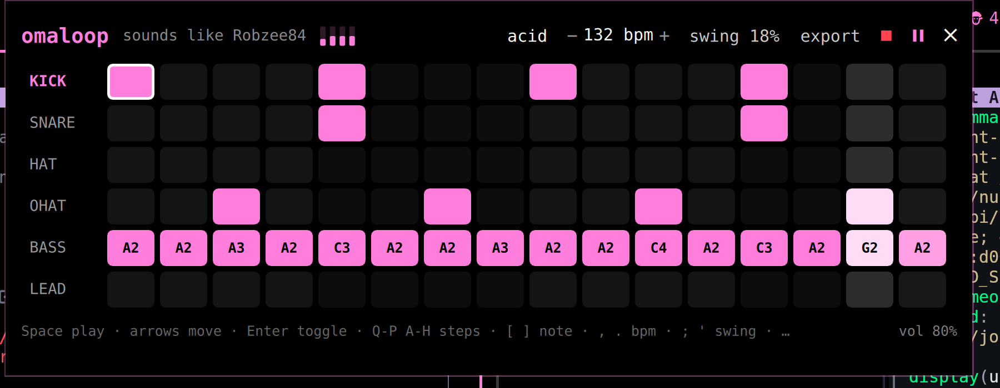
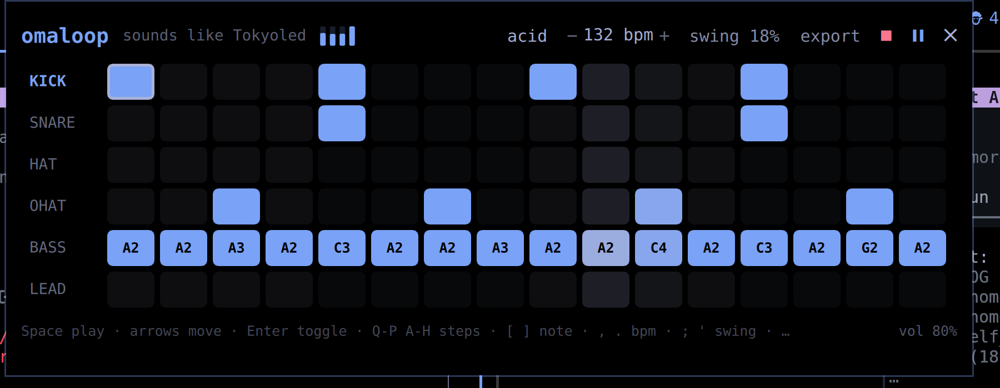
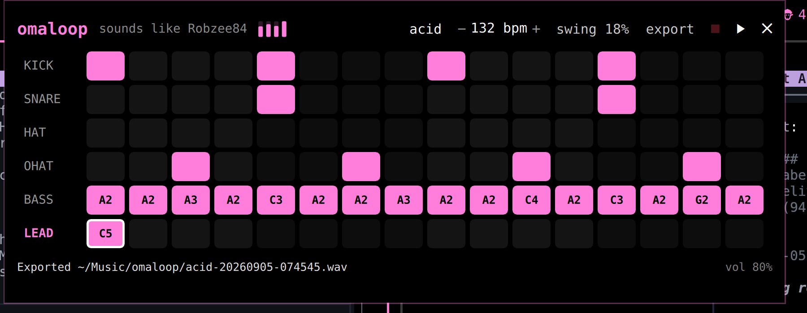

# omaloop

A drop-down groovebox for [Omarchy](https://omarchy.org). Press SUPER+ALT+L. A 16-step drum machine, a bass line, and a lead synth slide down from the top of the screen in your theme's colors. Make a loop. Press SUPER+ALT+L again and it slides away while the loop keeps playing.

No samples, no DAW, no config. A small Rust engine generates four drums and two synths and sends them straight to PipeWire.

**Your theme has a sound.** The active theme's palette sets the filter, oscillator spread, drive, and sub weight. Switch themes mid-loop and the sound changes with the colors.




## Install

```sh
omarchy plugin add https://github.com/joshuaswarren/omaloop --enable
~/.config/omarchy/plugins/io.github.joshuaswarren.omaloop/install.sh --bind
```

`install.sh` builds the engine with cargo. With `--bind` it also appends a SUPER+ALT+L binding to `~/.config/hypr/bindings.lua`. Without `--bind` it prints the line for you to add yourself. If the engine is missing, the panel shows a Build button that runs the same build.

Toggle without the keybind:

```sh
omarchy-shell shell toggle io.github.joshuaswarren.omaloop
omarchy-shell shell summon io.github.joshuaswarren.omaloop '{"preset":"acid","play":true}'
```

Requires Omarchy 4 (Quattro) and Rust 1.75+.

## Play it

| Key | Does |
|---|---|
| `Space` | play / pause |
| arrows | move the cursor |
| `Enter` or `X` | toggle the cell under the cursor |
| `Q W E R T Y U I O P A S D F G H` | toggle steps 1-16 in the cursor's row |
| `1` - `6` | jump to a row |
| `[` `]` | move a bass or lead note down / up the scale (A minor) |
| `,` `.` | BPM -1 / +1 (Shift for 5) |
| `;` `'` | swing -5% / +5% |
| `-` `=` | volume |
| `Shift+P` | next preset (y2k, acid, minimal, breaks) |
| `Shift+R` | randomize the cursor's row (drums by density, notes in scale) |
| `Shift+C` or `Delete` | clear the cursor's row |
| `Shift+E` | export 4 bars to `~/Music/omaloop/<preset>-<time>.wav` |
| `Esc` | hide (the loop keeps playing; the red square stops it) |

Mouse works too: click a cell, scroll on a note cell to transpose, click the preset name to cycle, scroll on swing or volume.



The pattern is saved on every change to `~/.config/omaloop/pattern.json` and comes back on the next boot.

## Why this exists

Omarchy 4 rebuilt the desktop as one Quickshell process. The community started shipping plugins for it overnight. The ones that spread make the desktop do something new in the theme's own colors. Every music plugin so far plays other people's music. omaloop makes the desktop itself an instrument.

In 2000 I produced techno as DJ Zip in FruityLoops with an Akai AX-60 and a Yamaha DD-50. "A Y2K Time Warp" won amp3.com's first Pick Hit Gold of the year on 2000-01-02. The default `y2k` preset is that loop's shape: four-on-the-floor at 138, a clap on 2 and 4, offbeat hats, a walking A-minor bass, and a detuned three-saw lead. The lead is a 3xOSC homage on purpose.

## How the theme becomes a sound

The panel reads the shell's live palette (`Color.accent`, `Color.background`). Whenever it changes, the panel sends one `tone` message to the engine:

| Palette | Synth |
|---|---|
| accent lightness | filter cutoff (brighter accent, brighter lead and bass) |
| accent hue | oscillator detune spread |
| accent saturation | drive (tanh soft clip on the mix) |
| background darkness | sub weight under the kick and bass |

No table of theme names. Custom themes get a sound too. The four small bars in the header show the current values.

## Architecture

```
OmaloopPanel.qml   Quickshell panel, theme colors from qs.Commons, all keys
      |  Quickshell.Io.Process: JSON lines over stdin / stdout
      v
omaloop-engine     Rust, ~600 lines: 16-step clock with swing, 6 voices,
      |            dotted-eighth delay, soft clip, state file, WAV export
      v
PipeWire           via cpal
```

The engine is usable on its own:

```sh
cd engine && cargo build --release
./target/release/omaloop-engine --render demo.wav --bars 4 --preset breaks
./target/release/omaloop-engine --play --state /tmp/p.json   # then type JSON lines
```

```json
{"cmd":"preset","name":"acid"}
{"cmd":"step","track":"ohat","index":14,"on":true}
{"cmd":"note","track":"lead","index":0,"note":69}
{"cmd":"tone","cutoff":0.2,"detune":0.8,"drive":0.5,"sub":0.9}
{"cmd":"swing","value":0.2}
{"cmd":"random","track":"bass"}
{"cmd":"export","path":"/tmp/loop.wav","bars":8}
{"cmd":"dump"}
```

Events come back as `{"event":"step","index":n}` on every step. `dump` answers with `{"event":"state",...}`. A finished render sends `{"event":"exported","path":...}`. Drum tracks are `kick`, `snare`, `hat`, `ohat` (booleans). Note tracks are `bass` and `lead` (MIDI notes, 0 = rest). A closed hat chokes the open hat.

## Layout

```
manifest.json      Omarchy plugin manifest (panel + bar widget)
OmaloopPanel.qml   the drop-down
BarWidget.qml      "♪ loop" in the bar; click toggles the panel
install.sh         build + optional SUPER+ALT+L binding
engine/            the Rust groovebox
```

## License

MIT
