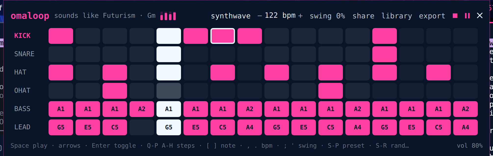

# omaloop

**Your Omarchy theme is a loop.** Press SUPER+ALT+L and a groovebox drops down from the top of the screen in your theme's colors, already playing a loop the theme composed. Switch theme and it composes a new one. Press Ctrl+C and the loop is a link you can tweet.




Same plugin, two themes, two loops. No samples, no DAW, no config, no network. A small Rust engine synthesizes four drums, a bass, and a lead and sends them straight to PipeWire.

## Install

```sh
omarchy plugin add https://github.com/joshuaswarren/omaloop --enable
~/.config/omarchy/plugins/io.github.joshuaswarren.omaloop/install.sh --bind
```

The first line clones this repo the standard Omarchy way. The second builds the engine (needs [Rust](https://rustup.rs)) and registers the `omaloop://` link handler. With `--bind` it also adds SUPER+ALT+L to `~/.config/hypr/bindings.lua`. Leave `--bind` off and it prints the line for you instead. Skip the script and the panel shows a Build button that runs the same `cargo build`.

Requires Omarchy 4 (Quattro), Rust 1.75+, and `wl-clipboard` (already on Omarchy).

## Remove

```sh
~/.config/omarchy/plugins/io.github.joshuaswarren.omaloop/install.sh --uninstall
omarchy plugin remove io.github.joshuaswarren.omaloop
```

The first line removes the link handler and the keybinding it added. The second removes the plugin. Your loops in `~/.config/omaloop` and exports in `~/Music/omaloop` are left for you to keep or delete.

## What a theme becomes

The panel reads the shell's live palette (accent, background, foreground, urgent, muted) and reduces it to four numbers and a seed:

| Feature | From | Decides |
|---|---|---|
| energy | accent saturation and accent-to-background contrast | techno or synthwave (high) against boombap or deep (low) |
| warmth | accent hue, orange high and blue low | warm styles (synthwave, boombap) against cool ones (techno, deep) |
| brightness | background lightness | light themes get house, in a major key |
| spice | urgent color saturation | how busy the lead is |
| seed | a hash of all five colors | the exact notes inside the style's rules |

The engine composes inside each style's vocabulary. Techno gets four-on-the-floor and offbeat open hats. Boombap gets a swung two-kick pattern with dorian color. Synthwave gets an arpeggiated chord. Deep gets long sub notes and one lead phrase. House gets root-fifth bass and stabs. Tempo and swing come from the style with a little seeded variation. The same theme always writes the same loop, so "what does Catppuccin sound like" has one answer.

The palette also sets the tone, live:

| Palette | Synth |
|---|---|
| accent hue | the key (12 hues, 12 keys, applied as a playback transpose so your notes stay where you put them) and oscillator spread |
| accent lightness | filter cutoff |
| accent saturation | drive (tanh soft clip on the mix) |
| background darkness | sub weight under the kick and bass |

Custom themes get a loop too. Switching theme saves the outgoing loop to your library as `before theme switch` first, so nothing you made is lost.

## Play it

| Key | Does |
|---|---|
| `Space` | play / pause |
| arrows | move the cursor |
| `Enter` or `X` | toggle the cell under the cursor |
| `Q W E R T Y U I O P A S D F G H` | toggle steps 1-16 in the cursor's row |
| `1` - `6` | jump to a row |
| `[` `]` | move a bass or lead note down / up the scale |
| `,` `.` | BPM -1 / +1 (Shift for 5) |
| `;` `'` | swing -5% / +5% |
| `-` `=` | volume |
| `Shift+G` | new loop from the current theme (each press is a new variation) |
| `Shift+P` | cycle the hand-made presets (y2k, acid, minimal, breaks) |
| `Shift+R` | randomize the cursor's row (drums by density, notes in scale) |
| `Shift+C` or `Delete` | clear the cursor's row |
| `Shift+E` | export 4 bars to `~/Music/omaloop/<name>-<time>.wav` |
| `Ctrl+C` | copy a share link for this loop |
| `Ctrl+V` | load a loop from a link or code on the clipboard |
| `Ctrl+S` | save to your library (type a name, Enter) |
| `Ctrl+O` | open the library (Up/Down, Enter loads, Delete removes) |
| `Esc` | hide (the loop keeps playing; the red square stops it) |

Mouse works too: click a cell, scroll on a note cell to transpose, click the preset name to cycle, scroll on swing or volume. While the panel is down it owns the keyboard, like Omarchy's menus. Nothing you play leaks into the window underneath.

## Share a loop

Ctrl+C puts a link like this on your clipboard:

```
https://joshuaswarren.github.io/omaloop/#AUEEEJBVVQCAIQAAIQAAIQAAACEAACQAAAAAAAAAAAAARQBIAAAAAAB9QObMM4AH
```

The 64 characters after `#` are the whole loop: 4 drum masks, 32 notes, tempo, swing, tone, and key, in 48 bytes. Anyone who opens the link gets a static page that plays the loop in the browser and shows the grid. The page is a JavaScript port of the engine. If they have omaloop, the "open in omaloop" button hands the code to their panel through the `omaloop://` scheme. Their theme decides how it sounds. Ctrl+V loads a link or bare code from the clipboard.

## Where things live

| Path | What |
|---|---|
| `~/.config/omaloop/pattern.json` | the current loop, written on every change |
| `~/.config/omaloop/patterns/<name>.json` | your library |
| `~/Music/omaloop/*.wav` | exports |
| `~/.local/share/applications/omaloop.desktop` | the `omaloop://` handler, written by `install.sh` |
| `~/.config/hypr/bindings.lua` | one appended `o.bind` line, only with `install.sh --bind` |

## What it runs and touches

Written for anyone reviewing this plugin before enabling it.

- The panel (`OmaloopPanel.qml`) spawns one child process, `engine/target/release/omaloop-engine`. It is built from the Rust source in this repo with `cargo build --locked`. Dependencies are pinned in `engine/Cargo.lock`: cpal (audio), hound (WAV), serde_json, parking_lot. The engine reads stdin. It writes stdout, the state file, library files, and the WAV exports you ask for.
- The panel also runs `test`, `cargo build --release` (Build button only), `wl-copy` (Ctrl+C), and `wl-paste -n` (Ctrl+V). It reads `~/.local/state/omarchy/current/theme.name` to show the theme name.
- `bin/omaloop-open` is the `omaloop://` handler. It extracts a 64-character `[A-Za-z0-9_-]` code from the URL and calls `omarchy-shell shell summon` with it. It ignores anything else.
- `install.sh` runs only when you run it. It never downloads a script, never uses sudo or pkexec, and only writes the files listed above. `--uninstall` reverses it.
- No network access anywhere in the plugin. The share page is static HTML on GitHub Pages and does not phone home.
- `omarchy plugin validate` passes; there are no symlinks and no bundled binaries in the repo.

## Architecture

```
OmaloopPanel.qml   Quickshell panel, theme colors from qs.Commons, all keys
      |  Quickshell.Io.Process: JSON lines over stdin / stdout
      v
omaloop-engine     Rust, one file: 16-step clock with swing, 6 voices,
      |            dotted-eighth delay, soft clip, composer, loop codes,
      |            state file, library, WAV export
      v
PipeWire           via cpal
```

The engine is usable on its own:

```sh
cd engine && cargo build --release
./target/release/omaloop-engine --render demo.wav --bars 4 --preset breaks
./target/release/omaloop-engine --render shared.wav --bars 4 --code AUEEEJBVVQCAIQAAIQAAIQAAACEAACQAAAAAAAAAAAAARQBIAAAAAAB9QObMM4AH
./target/release/omaloop-engine --play --state /tmp/p.json   # then type JSON lines
```

```json
{"cmd":"generate","seed":42,"energy":0.7,"warmth":0.3,"brightness":0.1,"spice":0.5}
{"cmd":"preset","name":"acid"}
{"cmd":"step","track":"ohat","index":14,"on":true}
{"cmd":"note","track":"lead","index":0,"note":69}
{"cmd":"tone","cutoff":0.2,"detune":0.8,"drive":0.5,"sub":0.9,"transpose":7}
{"cmd":"swing","value":0.2}
{"cmd":"code"}
{"cmd":"load","code":"AUEEEJBVVQCAIQAAIQAAIQAAACEAACQAAAAAAAAAAAAARQBIAAAAAAB9QObMM4AH"}
{"cmd":"save","name":"friday"}
{"cmd":"list"}
{"cmd":"export","path":"/tmp/loop.wav","bars":8}
{"cmd":"dump"}
```

Events come back as `{"event":"step","index":n}` on every step. `dump` answers with `{"event":"state",...}`. A finished render sends `{"event":"exported","path":...}`. Drum tracks are `kick`, `snare`, `hat`, `ohat` (booleans). Note tracks are `bass` and `lead` (MIDI notes, 0 = rest). A closed hat chokes the open hat.

## Why

Omarchy 4 rebuilt the desktop as one Quickshell process. The community started shipping plugins for it overnight. The ones that spread make the desktop do something new in the theme's own colors. Every music plugin so far plays other people's music. omaloop makes the desktop itself an instrument.

In 2000 I produced techno as DJ Zip in FruityLoops with an Akai AX-60 and a Yamaha DD-50. "A Y2K Time Warp" won amp3.com's first Pick Hit Gold of the year on 2000-01-02. The `y2k` preset is that loop's shape, and the lead is a 3xOSC homage on purpose.

## Layout

```
manifest.json      Omarchy plugin manifest (panel + bar widget)
OmaloopPanel.qml   the drop-down
BarWidget.qml      "♪ loop" in the bar; click toggles the panel
install.sh         build, omaloop:// handler, optional keybinding, --uninstall
bin/omaloop-open   the omaloop:// handler
engine/            the Rust groovebox
docs/index.html    the share page (GitHub Pages), a JS port of the engine
```

## License

MIT
